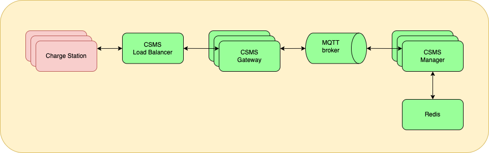

# Design

MaEVe is designed to be scalable and robust. The solution is currently split into two
components.

1. The [gateway](gateway) is a stateful service that accepts OCPP websocket connections from charge stations.
   OCPP messages from charge stations are unpacked and published on an MQTT topic. OCPP messages from the
   CSMS are read from another MQTT topic and sent to the charge station over the established websocket.
2. The [manager](manager) is a stateless service that reads from and writes to the relevant MQTT topics to
   generate responses to OCPP calls that come from the charge station, make OCPP calls to the charge station and handle the
   associated responses.

This design allows the whole CSMS to scale horizontally, allows changes to be made to the CSMS manager without
interrupting connections and allows changes to the gateway (which should be less frequent as it is a
thin layer with minimal business logic in it) to be incrementally rolled out so only a subset of charge stations
are disconnected at any specific point.

There are high-performance MQTT brokers that can process millions of messages per second, so this is not
expected to be a limiting factor.

The use of Redis to store transaction details enables the manager component to be stateless.

## Evolution

The design of MaEVe is expected to evolve and grow as it becomes more mature. It is expected that this will include
the introduction of a device registry that will maintain all the details of the charge stations and their current state.
This registry will be used by both the gateway component (for authorizing charge stations) and the manager component
(for updating state etc).

Much of the evolution will be guided by the needs of implementing the various OCPI modules. 
